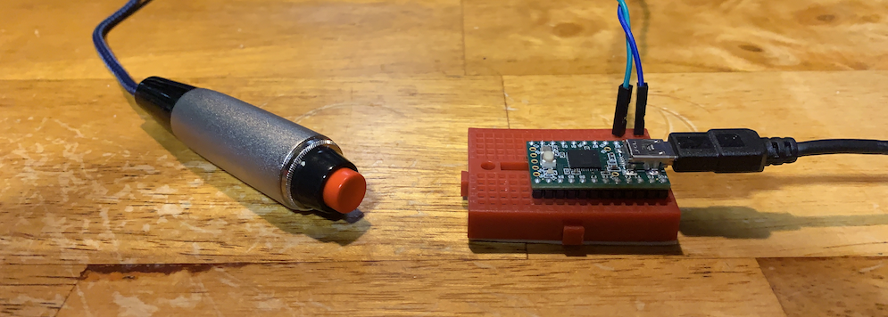

## Introduction
I'm spending a lot of time in virtual meetings due to COVID.  Apps like Teams and Zoom offer a way to connect with my co-workers.

For one-on-one meetings an open mic is fine but during group meetings I keep my mic muted unless I’m talking. This keeps my background noise from interrupting the speaker and is generally good form in group meetings.

I picked up an app called [Talk Toggle](https://www.microsoft.com/en-us/p/talk-toggle/9nrjcs6g10kt#activetab=pivot:overviewtab) which provides system wide Push-To-Talk functionality> I then configured it to recognize F13 as its hotkey and remapped the menu key to send F13 with [AutoHotKey](https://www.autohotkey.com/).  On the Mac the app [MuteKey](https://apps.apple.com/us/app/mutekey/id1509590766?mt=12) has similar functionality.

While I had a passing "push-to-talk" setup I kept forgetting to press the PTT hotkey when I started talking.  I needed something I could hold in my hands as a reminder.  A quick google and I saw that there were options but they all cost more then I wanted to pay or didn't work like I wanted.  I decided to build my own PTT solution.

## Shopping List
1. [Handheld push button](https://www.ebay.com/itm/122657808383) - I use the Philmore 30-825, but any momentary switch will work.
   1. I recently added a [Linemaster T-91-S](https://linemaster.com/product/378/Treadlite-Ii/T-91-S/) foot pedel that works well.
1. Any micro-controller that can emulate an HID will work.  Two options are:
   1. [Teensy USB Development Board (with pins)](https://www.pjrc.com/store/teensy_pins.html)
   1. [Raspberry Pi Pico](https://www.raspberrypi.org/products/raspberry-pi-pico/)
1. [USB Cable - A-Male to Mini-B Cord](https://www.pjrc.com/store/cable_usb_micro_b.html)
1. [Heat shrink tube](https://www.amazon.com/560PCS-Heat-Shrink-Tubing-Eventronic/dp/B072PCQ2LW)
1. Miscellaneous wires.  I used an broken USB-C cable and some wires I had laying around.

## Building with the Teensy

### Assembly
Connect wires between the handheld push button poles and  pins `B1` and `GND`.  This is a simple switch so it doesn't matter which wire is connected to which pin.  I used a breadboard and some jumper wires to avoid soldering to the teensy board.  Heat shrink up any soldered wires too keep things safe and looking clean.

### Code
Start up [Teensy](https://www.pjrc.com/teensy/td_download.html) and load the below code onto the teensy.  It will detect when B1 is closed and will press `ALT+SPACE`.  With the above Talk Toggle or MuteKey, pressing the `ALT+SPACE` will unmute the mics.  Release the PTT button and the teensy will release `ALT+SPACE`, reactivating mic mute.

````c
#include <Bounce.h>

Bounce buttonPTT = Bounce(PIN_B1, 10);

void setup() {
  pinMode(PIN_B1, INPUT_PULLUP); // PTT button
  pinMode(PIN_D6, OUTPUT); // LED
}

void loop() {

  buttonPTT.update();

  // When the button is pushed, send ALT+SPACE down
  if (buttonPTT.fallingEdge()) {
    Keyboard.press(MODIFIERKEY_ALT);
    Keyboard.press(KEY_SPACE);
    digitalWrite(PIN_D6, HIGH); // LED ON
  }

  // When the button is release, send ALT+SPACE release
  if(buttonPTT.risingEdge()) {
    Keyboard.release(MODIFIERKEY_ALT);
    Keyboard.release(KEY_SPACE);
    digitalWrite(PIN_D6, LOW); // LED OFF
  }
}
````

## Building with the Raspberry Pi Pico
At $4 US, these are cheap MPC drive the cost of the project to less then $20 (slightly more than the cost of the Teensy alone).  My main reluctance in using the pico is that HID emulation [is currently not supported](https://github.com/micropython/micropython/issues/6811) in the [MicroPython](https://micropython.org/).  Instead I use [CircuitPython](https://circuitpython.org/) to emulate a keyboard with the [Adafruit HID library](https://github.com/adafruit/Adafruit_CircuitPython_HID).  CircuitPython (as of 2021-03-06) shows up as a USB drive when plugged in which makes for easy code editing but some companies have strict no-USB drive policy on company laptops.  As a result the pico option is not as widely usable as the Teensy which just shows up as a keyboard.

### Assembly
Connect wires between the handheld push button poles and pins `GP15` and `3v3`.  This is a simple switch so it doesn't matter which wire is connected to which pin.  I used a breadboard and some jumper wires to avoid soldering to the pico board.  Heat shrink up any soldered wires too keep things safe and looking clean.

### Code
1. Download [CircuitPython](https://circuitpython.org/board/raspberry_pi_pico/).  Select the UF2 and then install it on the pico.  The pico will reboot after copying the UF2 file over.  When it comes up, the pico will be accessable via the file browser.
1. Download [Adafruit_CircuitPython_HID](https://github.com/adafruit/Adafruit_CircuitPython_HID) for HID functionality.  Expand and then copy the lib folder contents to the pico lib folder
1. Create a file called `code.py` on the pi pico.  This will be the main code for your keyboard emulator.
1. Add the below code to `code.py`.  It will send a F13 key press when the button is pushed and release F13 when the button is released.

``` python
import time
import digitalio
import board
import usb_hid
from adafruit_hid.keyboard import Keyboard
from adafruit_hid.keycode import Keycode

# Emulate the HID Keyboard
keyboard = Keyboard(usb_hid.devices)

# Grab the LED for status indication
led = digitalio.DigitalInOut(board.LED)
led.direction = digitalio.Direction.OUTPUT

# Assign GP15 to the button
button_1 = digitalio.DigitalInOut(board.GP15)
button_1.direction = digitalio.Direction.INPUT
button_1.pull = digitalio.Pull.DOWN

is_active = False
while True:
    if button_1.value:
        led.value = True # Light up the LED to indicate the activity
        keyboard.press(Keycode.F13) # Send F13
        is_active = True # Track if the button is in a pushed state
    elif(is_active):  # only send the release if the button is active
        led.value = False # Turn off the LED as activity is stopping
        keyboard.release(Keycode.F13) # Release F13
        is_active = False # Indicate the button is no longer pushed.

    time.sleep(0.1)
```

#### Next Steps
Using the teensy or pico for this project is a bit of overkill.  I am planning on making a macro-keyboard, similar to the [DIY Stream Deck](https://www.partsnotincluded.com/diy-stream-deck-mini-macro-keyboard/).  With it I will be able to switch between [OBS](https://obsproject.com/) streams and potentially enable notification lights.

#### Miscellaneous links
1. [Original Inspiration](https://timmyomahony.com/blog/making-usb-push-buttons/)
1. [Helped me code the Teensy](https://www.pjrc.com/teensy/td_keyboard.html)
1. [Using Pico as an HID](https://hridaybarot.home.blog/2021/01/31/using-raspberry-pi-pico-has-hid-device-to-control-mouse-and-keyboard/) - Provided a good basis for using the pico as an HID.
1. [DIY Macro Keyboard video](https://www.youtube.com/watch?v=aEWptdD32iA) - Helped my craft my code for the pico.
1. [Pico StreamDeck](https://github.com/pjgpetecodes/pico-streamdeck) - Well this just looks cool.
